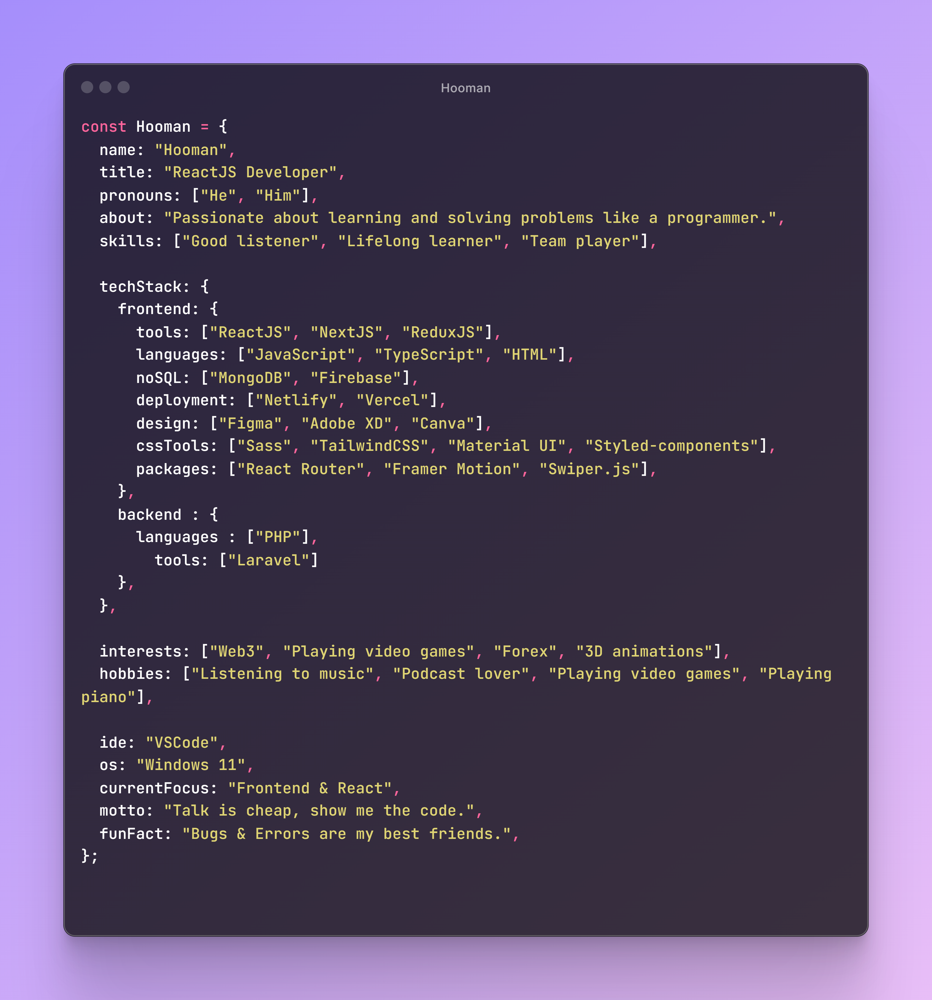

  

 
 

<h2 align="center">Autobiography 📖</h2>

<b>
 

&nbsp;&nbsp;&nbsp;&nbsp; 
 I'm Hooman Hajimohamadi 👋 — a Front-end Developer 🧑‍💻 based in Tehran, Iran 🇮🇷. I specialize in bringing ideas 💡 to life with JavaScript, React, and CSS magic ✨ (TailwindCSS fan here 🌀).

I enjoy working with startups 🫰, solving real-world problems, and always pushing the limits of what I can imagine 🚀.
Whether it’s building clean UIs, playing with animations, or collaborating on exciting projects, I’m all in!

 

</b> 

  

<h3 align="center">Skills + Tools</h3>

  
  
  
  
  
  
  
  
  
  
  
  
  
  
  
  
  
  
  
  
  
  
  
  
  
  
  
  
  
  

<h3 align="center"> Currently Learning Advanced Of</h3>

  
            
  
  

<h3 align="center">Plan To Learn</h3>

            

<h2 align="center">GitHub Contributions 📊 </h2>

  
  

<h2 align="center">GitHub Stats ⚡ </h2>

  
  

<h2 align="center">Most Used Languages 💡  </h2>

  

<h2 align="center"> My Contribution Snake 🐍</h2>

  <picture>
    <source media="(prefers-color-scheme: dark)" srcset="https://raw.githubusercontent.com/itzhoman/itzhoman/output/github-contribution-grid-snake.svg" />
    <source media="(prefers-color-scheme: light)" srcset="https://raw.githubusercontent.com/itzhoman/itzhoman/output/github-contribution-grid-snake.svg" />
    
  </picture>

<h2 align="center">Trophies </h2>

  
[]

<h2 align="center"> Official Links 🌐 </h2>

  <!-- LinkedIn -->
  

  <!-- GitHub -->
  

  <!-- Gmail -->
  

  

