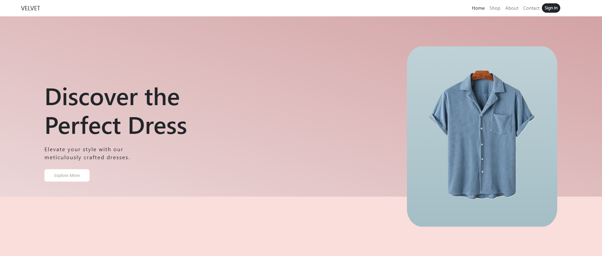

  

 
 

<h2 align="center">🧠 About Me</h2>

  

<h2 align="center">📖 Autobiography</h2>

  <b>
    Hi, I'm Hooman Hajimohamadi 👋 — a passionate Front-end Developer 🧑‍💻 based in Tehran, Iran 🇮🇷.  
    I specialize in bringing ideas 💡 to life with <b>JavaScript</b>, <b>React</b>, and a little bit of <b>CSS magic</b> ✨ 
    (big TailwindCSS fan here 🌀).  
    I love working with startups 🫰, solving real-world problems, and pushing the boundaries 🚀.  
    Whether it’s crafting clean UIs, adding smooth animations, or collaborating on exciting projects — I'm all in!
  </b>

  

  <h3>🚀 Recent Projects</h3>
  
<table>
    <tr>
      <td>
        
      </td>
      <td>
        
      </td>
    </tr>
    <tr>
      <td>
        
      </td>
      <td>
        
      </td>
    </tr>
    <tr>
      <td>
        
      </td>
    </tr>
</table>

 

<h3 align="center">🛠️ Skills & Tools</h3>

  <!-- Skill Icons -->
  
  
  
  
  
  
  
  
  
  
  
  
  
  
  
  
  
  
  
  
  
  
  
  
  
  
  
  
  
  

 

<h3 align="center">📚 Currently Advancing</h3>

  
  
  
  
  
  
  

 

<h3 align="center">🎯 Plan to Learn</h3>

  
  
  
  

<h2 align="center">📊 GitHub Contributions</h2>

  

<h2 align="center">⚡ GitHub Stats</h2>

  

<h2 align="center">💡 Most Used Languages</h2>

  

<h2 align="center"> My Contribution Snake 🐍</h2>

  <picture>
    <source media="(prefers-color-scheme: dark)" srcset="https://raw.githubusercontent.com/itzhoman/itzhoman/output/github-contribution-grid-snake.svg" />
    <source media="(prefers-color-scheme: light)" srcset="https://raw.githubusercontent.com/itzhoman/itzhoman/output/github-contribution-grid-snake.svg" />
    
  </picture>

<h2 align="center">🏆 GitHub Trophies</h2>

  

<h2 align="center"> Official Links 🌐 </h2>

  <!-- LinkedIn -->
  

  <!-- GitHub -->
  

  <!-- Gmail -->
  

  

